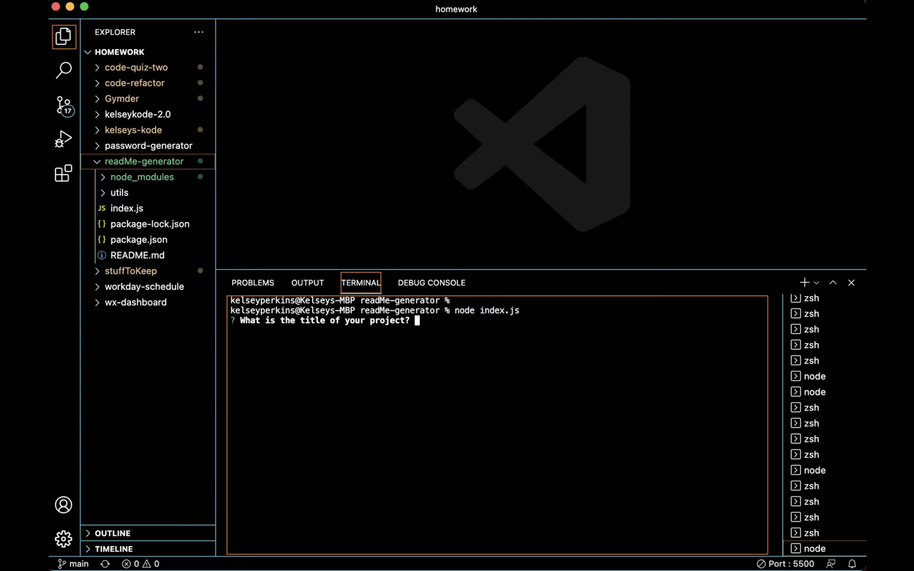

# Project Title: ReadMe Generator

  

# Description: 
  This application was created to generate a high-quality, professional README depending on a series of questions a user answers in their command line using Node.js

## Table of Contents
  - [Installation](#installation)
  - [Usage](#usage)
  - [Credits](#contributing)
  - [License](#license)
  - [Questions](#questions)

## Installation:
 The user will have to clone the repository from GitHub and download Node. This application also requires a file system and inquirer module.

## Usage:
 Use inquirer from your command line to answer questions about your project.
 <a href="https://www.youtube.com/watch?v=_LN-GRSUij4">Watch Tutorial</a>

## Preview 
Terminal Preview Screen

## Contributing:
  None
# License:
 The repo is licensed by: MIT 
# Questions:
Click here for my Github: https://github.com/kelsekodes
# Email Me:
  Send me an email!: kelseykodes@yahoo.com 
